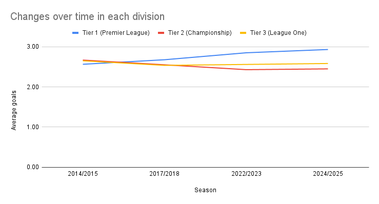

# English_football-goal-trends-analysis
Goal-scoring trend analysis across top 3 English football leagues in the English football pyramid

Objective: 
Analyze how average goals per match have changed across the top three tiers of English football over the past decade.

Data Source:
Match result data from Football-Data.co.uk for:
- Premier League (Tier 1)
- Championship (Tier 2)
- League One (Tier 3)

  Link: https://www.football-data.co.uk/englandm.php

## Spreadsheets analysis

Process:
- Imported seasonal CSV files
- Cleaned and merged datasets
- Created TotalGoals feature
- Built pivot analysis in Google Sheets

Average Goals Per Match by Tier and Season
Goal-Scoring Trends Over Time:

Average Goals per Match by Tier:

Key Findings:
- Premier League scoring steadily increased
- Championship slightly declined
- League One remained stable

Spreadsheet link: https://docs.google.com/spreadsheets/d/1aB-ryfwpBDqmpwW7AunOkvAi2Z7d3YZ5ZoWbwpzzFqk/edit?usp=sharing

## SQL Analysis

The pivot-table analysis was replicated using SQL in PostgreSQL to calculate average goals per tier and season.

Query used:  
[Average goals by tier and season](avg_goals_by_tier_season.sql)

Results:  
[SQL Table](sql_results.csv)

## Tableau Dashboard

Interactive Tableau Public dashboard:

[View Dashboard on Tableau Public](https://public.tableau.com/views/EnglishFootballGoalTrends/Dashboard1?:language=en-US&publish=yes&:sid=&:redirect=auth&:display_count=n&:origin=viz_share_link)

